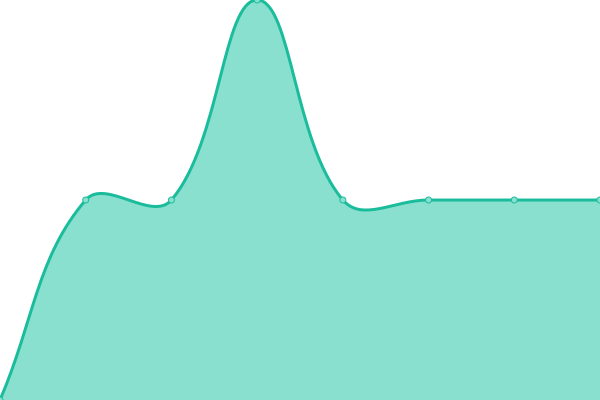

# [📈 Live Status](https://isanwenyu.github.io/upptime): <!--live status--> **🟩 All systems operational**

This repository contains the open-source uptime monitor and status page for [Paul Zhu](https://isanwenyu.github.io/upptime), powered by [Upptime](https://github.com/upptime/upptime).

With [Upptime](https://upptime.js.org), you can get your own unlimited and free uptime monitor and status page, powered entirely by a GitHub repository. We use [Issues](https://github.com/isanwenyu/upptime/issues) as incident reports, [Actions](https://github.com/isanwenyu/upptime/actions) as uptime monitors, and [Pages](https://isanwenyu.github.io/upptime) for the status page.

<!--start: status pages-->
<!-- This summary is generated by Upptime (https://github.com/upptime/upptime) -->
<!-- Do not edit this manually, your changes will be overwritten -->
<!-- prettier-ignore -->
| URL | Status | History | Response Time | Uptime |
| --- | ------ | ------- | ------------- | ------ |
|  [Emily GPT](https://emilygpt.fly.dev) | 🟩 Up | [emily-gpt.yml](https://github.com/isanwenyu/upptime/commits/HEAD/history/emily-gpt.yml) | 

 1106ms
     
 | 

<a href="https://isanwenyu.github.io/upptime/history/emily-gpt">97.73%</a>
    

|  [One GPT](https://one-gpt.fly.dev) | 🟩 Up | [one-gpt.yml](https://github.com/isanwenyu/upptime/commits/HEAD/history/one-gpt.yml) | 

 2329ms
     
 | 

<a href="https://isanwenyu.github.io/upptime/history/one-gpt">97.61%</a>
    

|  [Gemini Pro](https://gemini-pro.fly.dev) | 🟩 Up | [gemini-pro.yml](https://github.com/isanwenyu/upptime/commits/HEAD/history/gemini-pro.yml) | 

 1075ms
     
 | 

<a href="https://isanwenyu.github.io/upptime/history/gemini-pro">97.62%</a>
    

|  [Google DNS](8.8.4.4) | 🟩 Up | [google-dns.yml](https://github.com/isanwenyu/upptime/commits/HEAD/history/google-dns.yml) | 

 3ms
     
 | 

<a href="https://isanwenyu.github.io/upptime/history/google-dns">100.00%</a>
    

<!--end: status pages-->

[**Visit our status website →**](https://isanwenyu.github.io/upptime)

## 📄 License

- Powered by: [Upptime](https://github.com/upptime/upptime)
- Code: [MIT](./LICENSE) © [Anand Chowdhary](https://anandchowdhary.com), supported by [Pabio](https://pabio.com)
- Data in the `./history` directory: [Open Database License](https://opendatacommons.org/licenses/odbl/1-0/)
